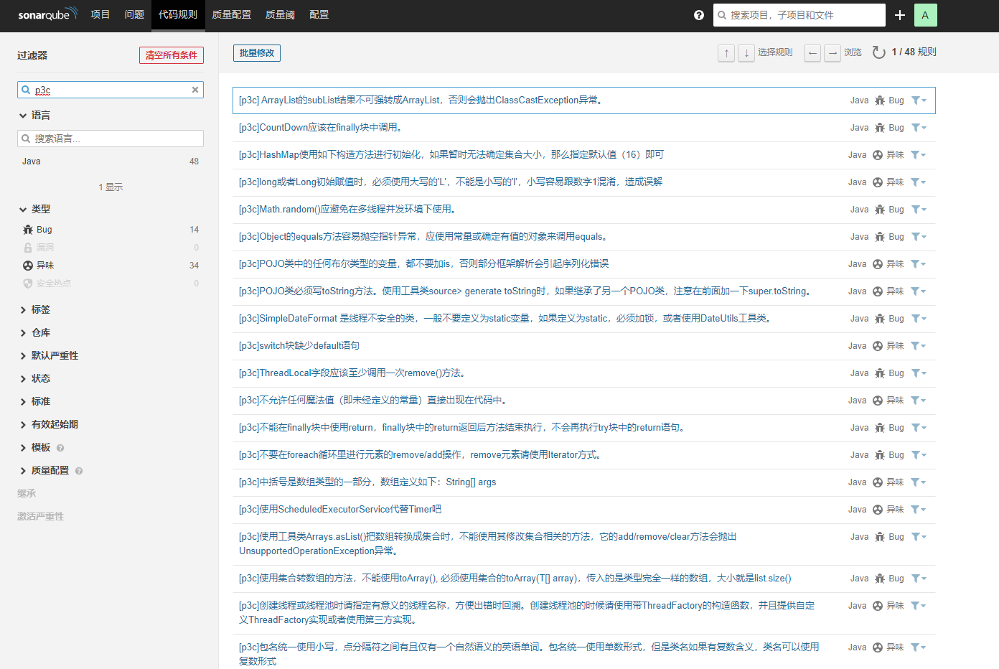

# SonarQube PMD P3C Plugin

> 根据 [sonar-pmd](https://github.com/jensgerdes/sonar-pmd) 修改

## 增加 [阿里巴巴代码规范P3C](https://github.com/alibaba/p3c)
 修改sonar规则说明为中文
 
## 安装

1. 执行`mvn clean package` 
2. 将`jar`包复制到sonar `./extensions/download` 目录下
3. 重启sonar服务完成安装

